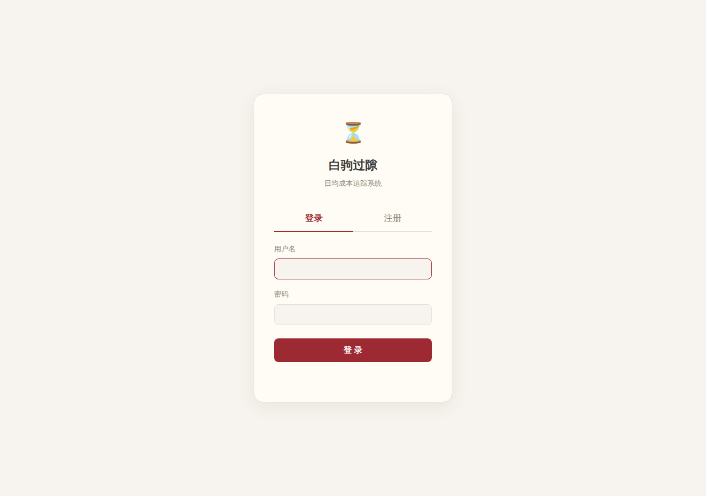
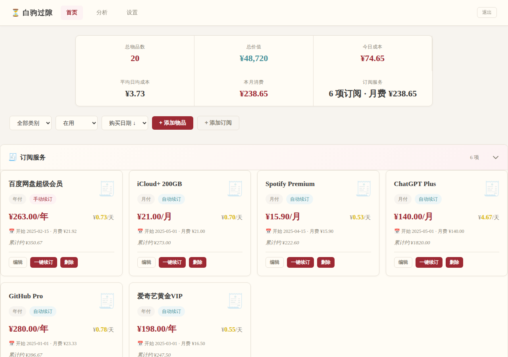
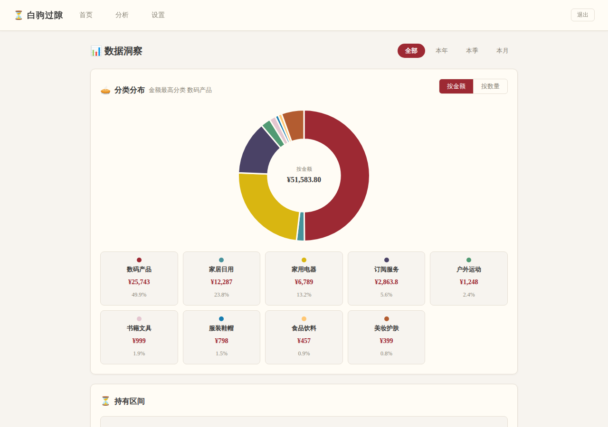
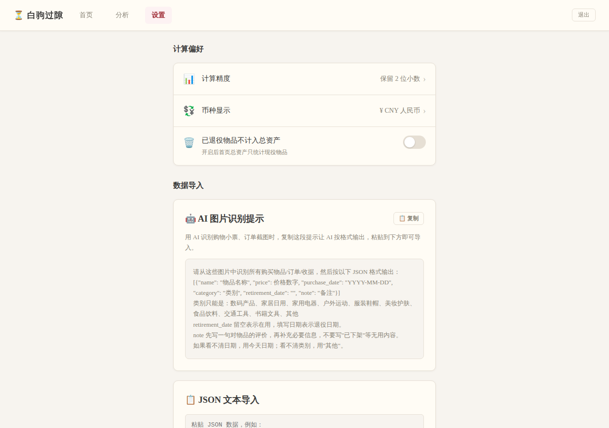
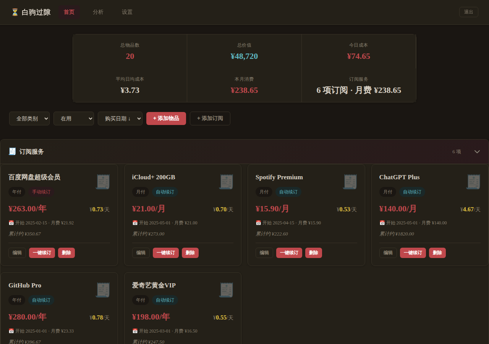

<div align="center">


# ⏳ 白驹过隙

**你的每一笔消费，都值得被看见。**

一个极简的个人物品日均成本追踪器 + 订阅服务管理工具。  
记录你拥有的一切，算出"这东西每天花了我多少钱"，让消费决策更清醒。

[](https://python.org)
[](https://fastapi.tiangolo.com)
[](https://sqlite.org)
[](LICENSE)
[](#pwa-支持)

<br/>

**[📥 下载](#-快速开始)** · **[📖 文档](#-api-接口)** · **[🐛 反馈](https://github.com/yourusername/cost-tracker/issues)**

</div>

---

## 📸 截图预览

<table>
  <tr>
    <td align="center"><b>🔐 登录页</b></td>
    <td align="center"><b>📊 首页总览</b></td>
  </tr>
  <tr>
    <td></td>
    <td></td>
  </tr>
  <tr>
    <td align="center"><b>📈 数据洞察</b></td>
    <td align="center"><b>🤖 AI 导入</b></td>
  </tr>
  <tr>
    <td></td>
    <td></td>
  </tr>
</table>

<div align="center">
  
  <br/>
  <sub>🌙 暗色模式 · 自动跟随系统设置</sub>
</div>

---

## ✨ 为什么选择白驹过隙？

### 🤖 拍照导入 — 和手动录入说再见

市面上的记账 App 都要你一条条手填？白驹过隙支持 **AI 图片识别导入**：

1. 打开 ChatGPT / Claude / 任意支持视觉的 AI
2. 把购物小票、订单截图、电商页面**拍照发给 AI**
3. AI 自动识别并输出标准 JSON
4. 粘贴到白驹过隙 → **一键导入** ✅

> 设置页内置了专门的 **AI 提示词模板**，复制即用，零门槛。

```json
// AI 输出示例 — 直接粘贴即可导入
[
  {"name": "MacBook Air M3", "price": 8999, "purchase_date": "2024-09-15", "category": "数码产品", "note": "主力开发机，续航惊人"},
  {"name": "Sony WH-1000XM5", "price": 2299, "purchase_date": "2024-03-10", "category": "数码产品", "note": "降噪天花板，通勤神器"}
]
```

还支持 **拖拽 JSON 文件上传**，选择即导入，无需二次确认。

---

### 🧾 订阅管理 — 每一分钱都心中有数

管理你的所有订阅服务，**月付、季付、半年付、年付**全覆盖：

- 📊 自动换算 **日均成本** 和 **月费汇总**
- 🔄 **一键续订** — 推移周期，标记自动续订
- 📈 订阅支出纳入整体分析，和实体物品统一查看
- 🔔 手动续订的服务一眼可见，不怕忘续

---

### 📊 数据洞察 — 不只是记账，更是消费分析

| 功能 | 说明 |
|------|------|
| 🥧 **分类分布** | 环形图展示各品类消费占比，支持按金额/数量切换 |
| 📅 **月度趋势** | 近 12 个月消费走势折线图 |
| 🏆 **日均排行** | 最"烧钱"物品 TOP 10，一目了然 |
| ⏳ **持有区间** | 半年内/半年-1年/1-2年/2年以上持有分布 |
| 📋 **消费榜单** | 历史消费 TOP 10 |
| ⏱️ **最长持有** | 持有时间最久的物品排行 |

支持按 **全部 / 本年 / 本季 / 本月** 筛选，已退役物品可选择性纳入统计。

---

### 🔐 多用户 + 数据隔离

- 每个用户拥有**独立的数据空间**，互不可见
- 支持管理员后台：用户管理、密码重置、权限控制
- **bcrypt 密码哈希**，session 30 天自动过期
- 全部 SQL 参数化查询，零注入风险

---

### 🎨 古风美学设计

- 🏛️ 古风色系配色，温暖不刺眼
- 🌓 **亮色 / 暗色模式**自动跟随系统
- 📱 **响应式布局**，手机、平板、桌面全适配
- 📅 **Flatpickr 日期选择器**，本地托管无 CDN 依赖
- 🖼️ 本地 vendor 目录托管所有前端依赖，**零外部请求**

---

### ⚡ 极致的工程品质

- ✅ 零 `SELECT *` — 全部明确字段
- ✅ 零 f-string SQL — 全部参数化查询
- ✅ 所有函数 ≤ 40 行
- ✅ `try/finally` 管理数据库连接
- ✅ Pydantic v2 数据验证
- ✅ SQLite WAL 模式，高并发读写

---

## 🚀 快速开始

### 环境要求

- Python 3.12+
- pip

### 一分钟部署

```bash
# 克隆项目
git clone https://github.com/yourusername/cost-tracker.git
cd cost-tracker

# 创建虚拟环境 & 安装依赖
python3 -m venv venv
source venv/bin/activate
pip install -r requirements.txt

# 启动
./start.sh
```

打开浏览器访问 `http://localhost:9271` 🎉

### 默认账户

| 用户名 | 密码 | 权限 |
|--------|------|------|
| `admin` | `admin` | 超级管理员 |

> ⚠️ 首次使用请立即修改默认密码

### Systemd 服务（推荐）

```bash
# 创建服务文件
cat > ~/.config/systemd/user/cost-tracker.service << 'EOF'
[Unit]
Description=Cost Tracker - Personal Asset Tracker
After=network.target

[Service]
Type=simple
WorkingDirectory=/path/to/cost-tracker
ExecStart=/path/to/cost-tracker/venv/bin/uvicorn app.main:app --host 0.0.0.0 --port 9271
Restart=always

[Install]
WantedBy=default.target
EOF

# 启用并启动
systemctl --user daemon-reload
systemctl --user enable --now cost-tracker

# 查看日志
journalctl --user -u cost-tracker -f
```

---

## 📱 PWA 支持

白驹过隙支持 **Progressive Web App**，可以像原生 App 一样安装到手机和桌面：

- 📲 移动端：浏览器菜单 → "添加到主屏幕"
- 💻 桌面：Chrome 地址栏右侧安装图标
- 🚀 Service Worker 缓存，离线也能浏览已加载的页面
- 🎨 自定义图标，主屏幕体验接近原生

---

## 🔌 API 接口

<details>
<summary>📋 点击展开完整 API 列表</summary>

### 认证

| 方法 | 路径 | 说明 |
|------|------|------|
| `POST` | `/api/register` | 用户注册 |
| `POST` | `/api/login` | 用户登录 |
| `POST` | `/api/logout` | 用户登出 |
| `GET` | `/api/auth/check` | 检查认证状态 |
| `POST` | `/api/change-password` | 修改密码 |
| `POST` | `/api/change-username` | 修改用户名 |

### 物品管理

| 方法 | 路径 | 说明 |
|------|------|------|
| `GET` | `/api/items` | 获取物品列表 |
| `POST` | `/api/items` | 创建物品 |
| `PUT` | `/api/items/{id}` | 更新物品 |
| `DELETE` | `/api/items/{id}` | 删除物品 |
| `POST` | `/api/items/import` | 批量导入物品（`?mode=append\|overwrite`） |

### 订阅服务

| 方法 | 路径 | 说明 |
|------|------|------|
| `GET` | `/api/subscriptions` | 获取订阅列表 |
| `POST` | `/api/subscriptions` | 创建订阅 |
| `PUT` | `/api/subscriptions/{id}` | 更新订阅 |
| `POST` | `/api/subscriptions/{id}/renew` | 一键续订 |
| `DELETE` | `/api/subscriptions/{id}` | 删除订阅 |

### 统计 & 分析

| 方法 | 路径 | 说明 |
|------|------|------|
| `GET` | `/api/stats` | 统计概览 |
| `GET` | `/api/analytics` | 分析数据（`?period=all\|year\|quarter\|month`） |
| `GET` | `/api/settings` | 获取设置 |
| `PUT` | `/api/settings` | 更新设置 |
| `GET` | `/api/export` | 导出全部数据（JSON） |
| `POST` | `/api/import-full` | 完整数据导入（含物品、订阅、设置） |

### 管理后台

| 方法 | 路径 | 说明 |
|------|------|------|
| `GET` | `/api/admin/users` | 用户列表 |
| `DELETE` | `/api/admin/users/{name}` | 删除用户 |
| `POST` | `/api/admin/users/{name}/promote` | 提升为管理员 |
| `POST` | `/api/admin/users/{name}/demote` | 撤销管理员 |
| `POST` | `/api/admin/users/{name}/reset-password` | 重置密码 |

</details>

---

## 🛠️ 技术栈

| 层级 | 技术 | 选型理由 |
|------|------|----------|
| **后端** | FastAPI + Uvicorn | 异步高性能，自动 OpenAPI 文档 |
| **数据库** | SQLite (WAL) | 零运维，单文件部署，WAL 支持并发读写 |
| **密码** | bcrypt | 工业级哈希，自动加盐 |
| **验证** | Pydantic v2 | 类型安全，自动序列化 |
| **图表** | Chart.js | 轻量级，丰富的图表类型 |
| **日期** | Flatpickr | 本地托管，中文友好，古风主题 |
| **前端** | 原生 HTML/CSS/JS | 零框架依赖，极速加载 |
| **认证** | Session Cookie | httponly + 30 天过期，XSS 安全 |

---

## 📁 项目结构

```
cost-tracker/
├── app/                        # 后端（11 个模块）
│   ├── main.py                 # 入口 + 路由注册 + 静态挂载
│   ├── config.py               # 配置常量（环境变量支持）
│   ├── database.py             # 数据库初始化
│   ├── models.py               # Pydantic 数据模型
│   ├── auth.py                 # 认证中间件 + 路由
│   ├── items.py                # 物品 CRUD
│   ├── subscriptions.py        # 订阅 CRUD + 续订
│   ├── analytics.py            # 统计分析 + 设置 + 导入导出
│   ├── admin.py                # 管理后台
│   └── utils.py                # 工具函数
├── frontend/                   # 前端页面
│   ├── index.html              # 首页（物品 + 订阅）
│   ├── analytics.html          # 数据洞察
│   ├── settings.html           # 设置 + 数据导入
│   ├── login.html              # 登录/注册
│   ├── admin.html              # 管理后台
│   ├── css/style.css           # 全局样式（古风色系 + 暗色模式）
│   ├── js/                     # JavaScript
│   ├── vendor/                 # 第三方库（本地托管）
│   ├── icons/                  # PWA 图标
│   ├── manifest.json           # PWA 配置
│   └── sw.js                   # Service Worker
├── requirements.txt            # Python 依赖
├── start.sh                    # 启动脚本
└── LICENSE                     # MIT License
```

---

## ⚙️ 配置

### 环境变量

| 变量名 | 说明 | 默认值 |
|--------|------|--------|
| `COST_TRACKER_DB` | 数据库文件路径 | `./data.db` |
| `COST_TRACKER_FRONTEND` | 前端目录路径 | `./frontend` |
| `COST_TRACKER_ADMIN_PASSWORD` | 默认管理员密码 | `admin` |

### 物品分类（固定 10 类）

`数码产品` · `家居日用` · `家用电器` · `户外运动` · `服装鞋帽` · `美妆护肤` · `食品饮料` · `交通工具` · `书籍文具` · `其他`

### 成本计算方式

| 方式 | 说明 | 适用场景 |
|------|------|----------|
| **按时间** | 价格 ÷ 持有天数 | 大部分耐用品 |
| **按频次** | 价格 ÷ 使用次数 | 消耗品、体验类 |
| **不计算** | 仅记录，不参与日均统计 | 礼物、收藏品 |

---

## 🤝 参与贡献

欢迎提交 Issue 和 Pull Request！

1. Fork 本仓库
2. 创建特性分支 (`git checkout -b feature/amazing-feature`)
3. 提交更改 (`git commit -m 'Add amazing feature'`)
4. 推送分支 (`git push origin feature/amazing-feature`)
5. 发起 Pull Request

### 开发规范

- [Google Python Style Guide](https://google.github.io/styleguide/pyguide.html)
- [阿里巴巴 Java 开发手册](https://github.com/alibaba/p3c)（通用编码规范）

---

## 📄 License

[MIT](LICENSE) © 2026

---

<div align="center">

**如果觉得有用，请给个 ⭐ Star 支持一下！**

<sub>时光如白驹过隙，每一笔消费都值得被记录。</sub>

</div>
